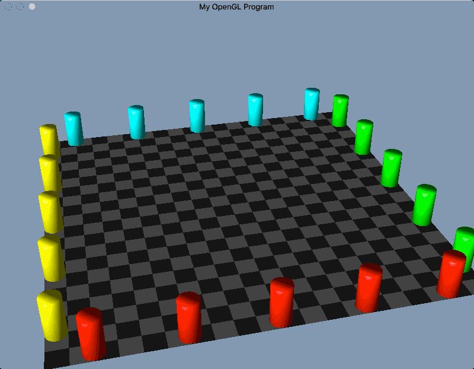

# CSCI 5611 - Animation and Planning in Games

## Projects

### Assignment 1: Particle System

### Assignment 2: Physical Simulation

### Assignment 3: Crowd Simulation

### Final Project: SPH Fluid Simulation

