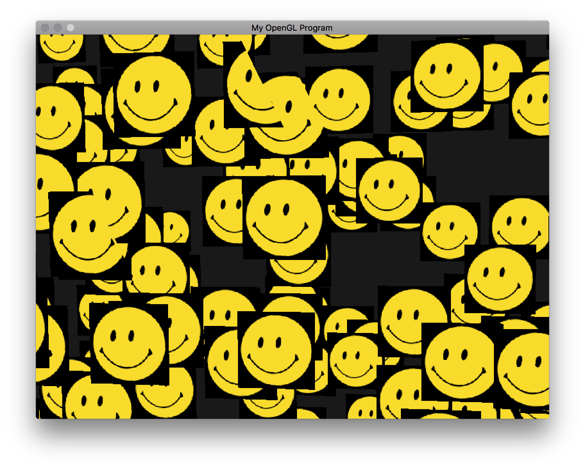

# CSCI 5611 - Assignment 1: Particle System
### by Jon Huh (huhnx025)

## Videos
[Link to YouTube playlist](https://www.youtube.com/playlist?list=PL2im8UxjQeu4_pMKZPrDiDDEmWDLEUhTf)

## Compile and run

```
$ cmake . && make && ./assignment1 [ball|water|fire|magic]
```

This requires CMake >= 3.1, which is included in the CSELabs machines.

## Extra Features
- (5) 3D user controlled camera (with WASD to move, arrow keys to look around, billboarded particles)
- (5) 3D implementation
- (5) Textured sprites for particles
- (5) Benchamrk 1: 500 particles at 20 FPS
- (10) Benchamrk 2: 1000 particles at 30 FPS
- (10) Benchamrk 3: 10000 particles at 30 FPS
- (5) Video(s) documenting your system and highlights features

Note: My simulations should be able to hit the benchmarks in the 4th floor Keller lab.

## Tools Used
- C++
- CMake
- OpenGL 3
- SDL2
- GLM vector math library
- Blender to create models
- [tinyobjloader](https://github.com/syoyo/tinyobjloader) to load .obj models

## Difficulties
I think I ended up spending most of my time tweaking all of the parameters that make each particle system look different, especially initial position, velocity, and acceleration. I can't think of any significant issues I ran into with the actual particle simulation though. I thought that was pretty straightforward. I also had some issues with loading the .obj models with tinyobjloader, but that was only because the array I was putting the model data in  wasn't laid out exactly the same way as my VBO, which took me a while to figure out. I also spent a lot of time figuring out how to use Blender to create, texture map, and export the models I made, like the fountain and logs.


## Art Contest Submission
_The ~~Birds~~ Smiley Faces_ - ~~Alfred Hitchcock~~ Jon Huhn

