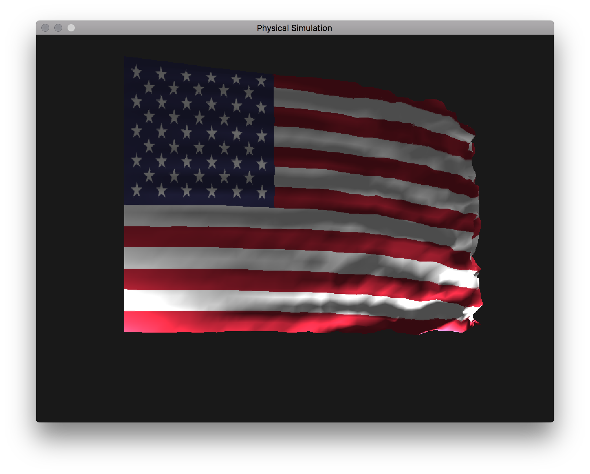

# CSCI 5611 Assignment 2: Physical Simulation
### by Jon Huh (huhnx025)

## Video


30x30 cloth with user-controlled sphere and drag with wind.


## Compile and run

```
$ cmake . && make && ./assignment2
```

I have a different flag demo that can be run as `$ ./assignment2 flag` also.

This requires CMake >= 3.1, which is included in the CSELabs machines.

### Controls

- Move with WASD
- Look around with arrow keys
- Move ball in xz-plane with IJKL


## Features

- (5) Real-time rendering (~100 FPS)
- (5) Video documenting your system and highlights features
- (5) 3D rendering, with user-controlled camera
- (5) Real-time user interaction with system
- (10) 2D mass-spring cloth simulation
- (10) 3D mass-spring cloth simulation
- (10) Drag terms
- (10) 1-way cloth-object interaction
- (5) 15x15 cloth at 20 FPS
- (5) 20x20 cloth at 20 FPS
- (5) 30x30 cloth at 30 FPS with obstacle interaction
- (5) Eulerian integrator
- (5) Midpoint integrator
- (10) Textured cloth
- (5) Wind component of drag term

Note: My simulations should be able to hit the benchmarks in the 4th floor Keller lab.


## Performance

I was pretty proud that I hit the highest benchmark without adding in any additional performance tweaks on top of my first implementation. For my simulations, just about all of the information for each node is stored in separate 1D arrays of floats. I also have two velocity buffers that get swapped after each simulation step. `vel1` stores the initial velocity of each node at the time step, and those values get copied into `vel2`. After the simulation, I swap the `vel1` and `vel2` pointers, so the next iteration, the updated velocities get copied into the other buffer. This saves the extra copy step at the end of the simulation if one buffer is only for "old" velocities and another is only for "new" velocities. I didn't implement a spatial data structure to speed up collision detection.

All in all, I was able to hit ~100 FPS with a 30x30 cloth with obstacle interaction and drag on the 4th floor Keller machines.


## Tools Used
- C++
- CMake
- OpenGL 3+
- SDL2
- GLM vector math library
- [tinyobjloader](https://github.com/syoyo/tinyobjloader) to load .obj models


## Difficulties

Most of the difficulties I encountered had to do with managing all of the different buffers for positions, velocities, and drag. It took me longer than I'd like to admit to figure out I wasn't allocating enough space for them so my simulations looked very wrong. The actual simulation didn't give me too much trouble since Prof Guy's pseudocode was super helpful.

I'm still pretty new to OpenGL, so things like rendering from multiple VAOs and VBOs, using different primitives, and changing VAO layouts gave me lots of little issues that I was able to work through.

One specific problem I encountered had to do with calculating drag. I wasn't zeroing out the drag force for each node after each simulation step, so drag from the previous time step was being counted for all future time steps. This means when I dropped a cloth that wasn't anchored at all, it would start out looking okay, and then eventually stop and start rising.


## Art Contest Submission


