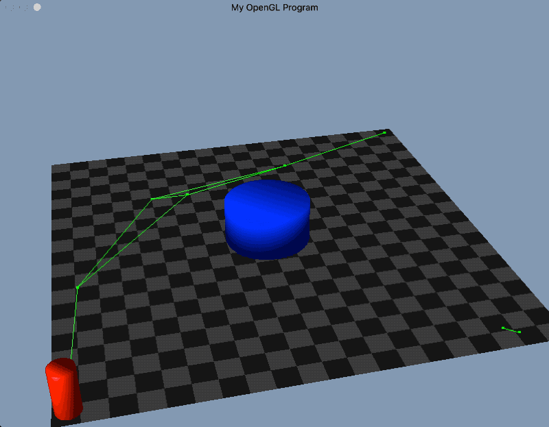
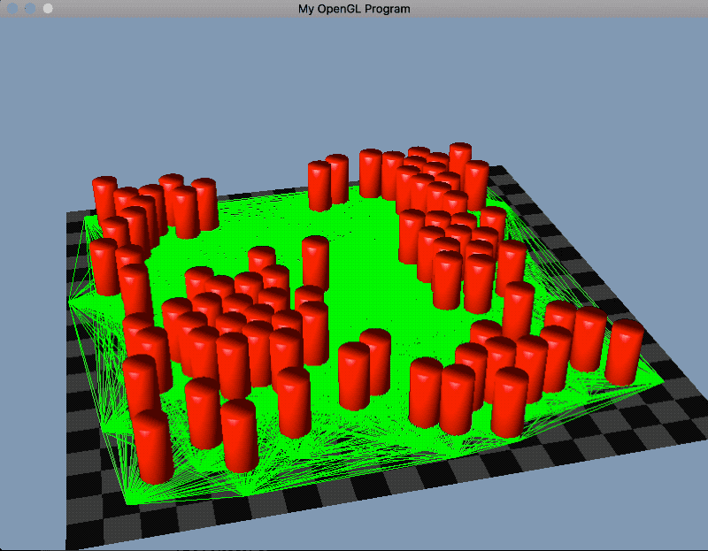
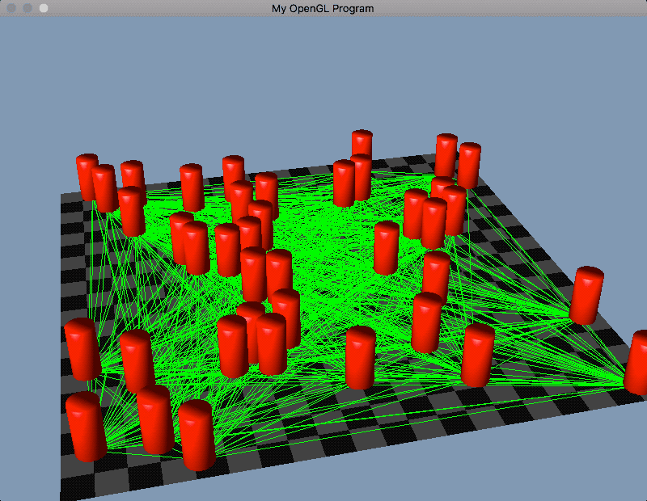
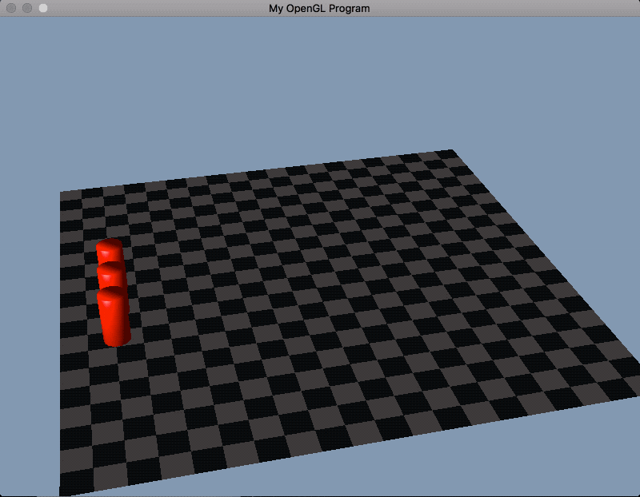
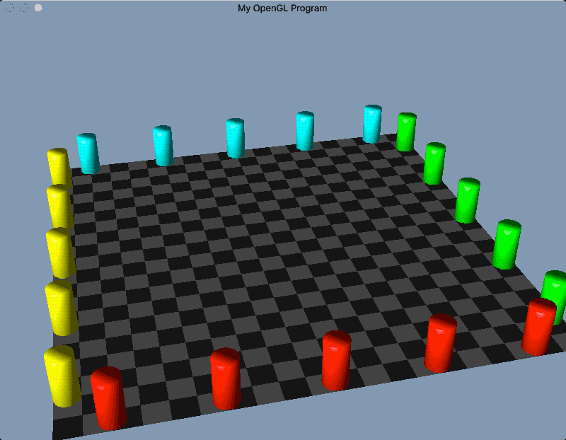
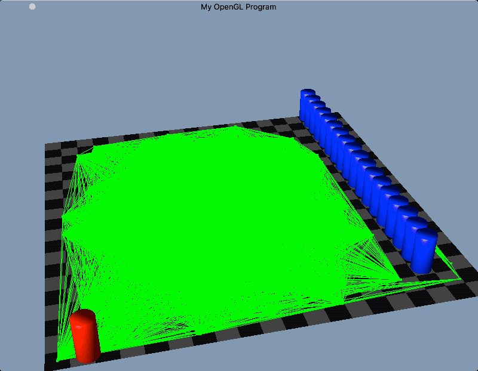
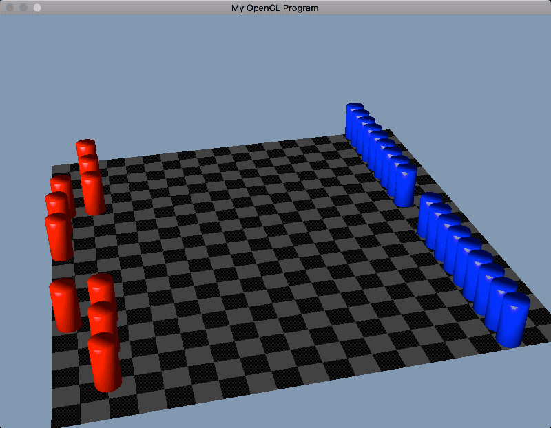
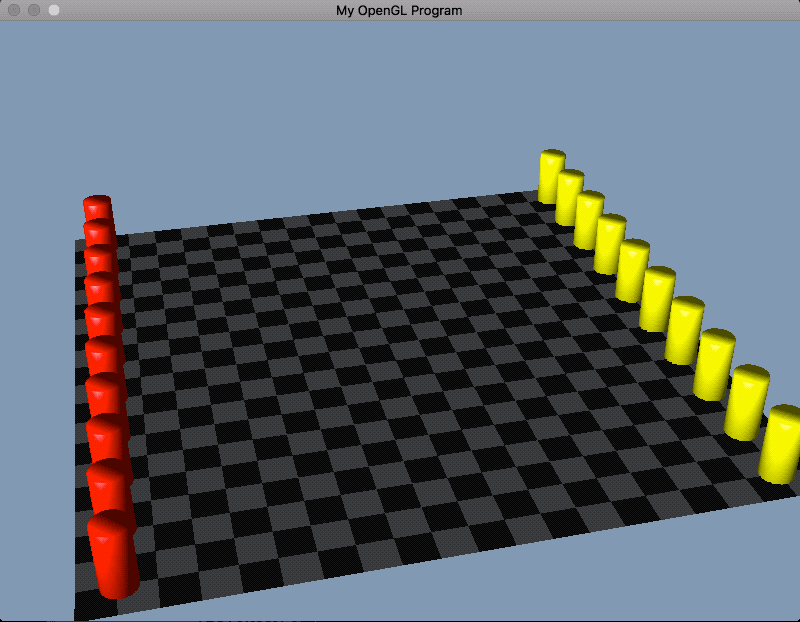

# CSCI 5611 Assignment 3: Crowd Simulation
### by Jon Huh (huhnx025)


## Compile and Run

```
$ cmake . && make && ./assignment3
```

### Controls

- Move with WASD
- Look around with arrow keys

## Examples

### Path Smoothing


### Boids Cohesion


### Boids Separation


### Boids Alignment


### Boids Altogether


### Many Agents with Competing Goals


### Navigating Through Local Minima




### Broken Scenarios


Agents without any separation force going in opposite directions reach deadlock. Adding some separation relieves the deadlock:


When the boids cohesion force is set too high, agents all flock together and none reach their goal because there is more force pulling them together than to their goals. Adjusting the cohesion force to a more reasonable value allows agents to reach their goals.


## A* vs. Uniform Cost Search

Each search was performed where an agent starts in the center of the plane and is searching for a goal in one corner. Since uniform cost search searches outward equally in all directions, this test should show the greatest disparity between uniform cost search and A* search.

|Nodes|Edges|uniform cost nodes expanded|A* nodes expanded
-|-|-|-
200|1266|173|17
1000|32584|1000|38
5000|796912|5000|44
25000|19886102|25000|30


## Features

- (5) 3D rendering of scenario and characters
- (5) A* for graph search
- (5) Path smoothing


## Tools Used

- C++
- CMake
- OpenGL 3+
- SDL2
- GLM vector math library
- [tinyobjloader](https://github.com/syoyo/tinyobjloader) to load .obj models


## Difficulties

Most of the issues I ran into had to do with animating an agent to follow a predefined path. It made more sense once I expressed it like a force, so it was more like the previous assignments. I also ran into some issues with OpenGL and using multiple shaders, since that was the first time I'd tried that. Making the PRM went surprisingly smooth though.
